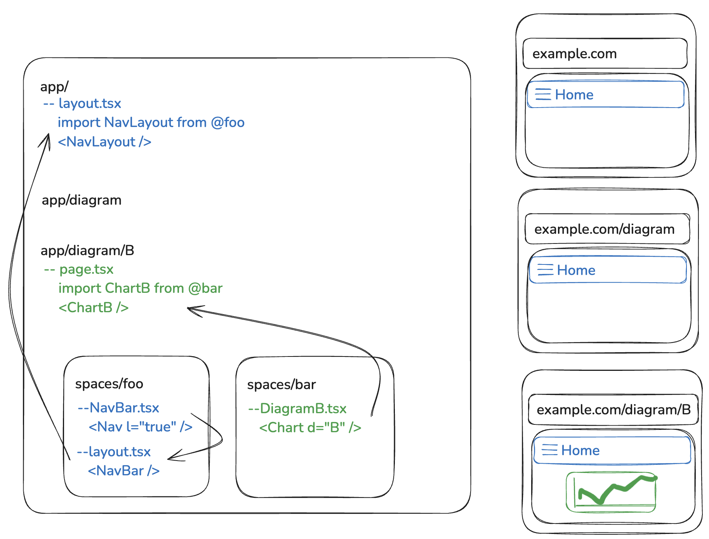

# Modular Micro Frontend Architecture

The repo contains a proposition of a micro frontend architecture within a single repository.

## Getting Started

After cloning the repo install dependencies using yarn. In the root folder run:
```
yarn
```

During development run application using dev mode. In the root folder run:
```
yarn dev
```

## Working with the repo (Architecture overview and Developer guide)

Each team owns a ["space"](./spaces/). They are the owners of their space. Other teams may contribute changes but those changes must be apprived by at least one of the engineers that own the space. The architecture within a space is defined by the owning team. Reasoning can be found [here](#architecture-in-each-individual-space-is-defined-by-the-owners).

The application was created using [NextJS framework](https://nextjs.org/docs). Reasoning can be found [here](#using-nextjs).

Each page is defined using a `page` file in the `app` folder. Homepage is defined in the root of the `app` folder. Each path is defined as a folder in `app` folder so for example path `/insights` is defined by folder structure `app/insights/page.tsx`. To create subpaths simply create subfolders for example `/insights/daily` is defined by folder structure `app/insights/daily/page.tsx`. 



### Delivering component to one page

If the component is intended to be rendered on one page, add the component to the page definition. Each page is defined in `app` folder as a `page` file. 

### Delivering component to multiple pages

If the component is intended to be rendered on multiple pages, but the placement depends on each individual page, add the component to each page's definition as described [here](#delivering-component-to-one-page).

If the component is intended to be rendered thoughout the application, create a dedicated `layout` file in the space and add it as a [nested layout](https://nextjs.org/docs/app/building-your-application/routing/pages-and-layouts#nesting-layouts) to the [main `layout` file](./app/layout.tsx). If some pages should not be showing the component define an opt out pages list and explicitly render `null` instead of the component on those pages. The component's owners need to approve any opt out page. 

### Dependencies

Each team maintains their dependencies by using a dedicated yarn workspace. Application level dependencies are limited to basic tooling like NextJS and React. All the other dependencies are to be owned and maintained by individual teams. 

To modify dependencies run:
```
yarn workspace <your_workspace> add/remove <dependency>
```

## Testing Strategy

Unit tests and Integration tests are required. Every util function should be tested with a unit test. Every component should be tested with an integration test.

CI/CD pipeline blocks any PR that fails tasts. When changes are made in a space only the tests in that space are run. In case of changes in `app` folder a dependency tree is checked and tests in all affected spaces are run.

### e2e tests

e2e tests are required for the main user journey owned by each space. 

## Mentoring/Onboarding

When introducing architecture for the first time dedicated workshops would be created for each team. This would generate institutional knowledge. 

Part of the ondoarding of FE new hires would be a session on architecture and best practices on the repo with focus on where to find information.

All relevant documentation will live in the repo (close to the code) so that developers do not have problems with finding it. Changes made to the core would be posted on the relevant developer channel (for example slack) and major changes will be additionally communicated via email.

## Decisions (Stakeholder communication)

### Architecture in each individual space is defined by the owners

Each team needs to be fully autonomous with minimal overhead to maximise their delivery speed. 

To facilitate each team's autonomy they fully own their solution. They're reponsible for the performance of their modules. They must adhere to the goals set for the SPA application, for example if the LCP on the homepage is defined to be t(n) but takes 3xt(n) React Profiler will be used to find the offending component and the owning team will be responsible for the improvement. Each team should allocate x amount of time monthly for operational excellence work. 

### Using NextJS

NextJS was chosen to minimise maintenance cost investment. 

NextJS provides a set of tools to manage a React Application. It provides a thorough documentation and an extensive number of fetaures. It's actively maintained. This means that it decreases the maintenance efforts on the teams' side. 

### Using a design system

Design system was chosen to ensure cohesion of the user experience.

Using a design system ensures that the UX on the whole of SPA is cohesive. The design team can be largely independent of the engineering teams. Each micro frontend defines the version they use so that breaking changes may be implemented at each team's schedule. It's especially relevant if multiple teams share the same page.

## What's missing

Here's the list of tasks remaining to make the solution production ready.

* Add CI/CD pipeline: Preferably using Github Actions.
* Testing: Add missing tests.
* PR process: Define the process of adding contributions and define code owners.
* Operational Excellence moniitoring [optional, can be added later]: Add tooling to monitor codebase health, for example code smell checker that provides weekly reports by each individual space. 
* Observability: Add a tool to obtain runtime metrics an error like Sentry and/or traces. 
